# AstraFin – Multi-Agent Banking System

> **Intelligent Banking Assistant combining Conversational AI with Mathematical Precision**

AstraFin is a production-ready multi-agent banking system that leverages specialized AI agents and deterministic financial algorithms to provide accurate, trustworthy financial advice. Built with a hybrid architecture that combines the natural language capabilities of LLMs with the precision of mathematical calculations.

[](https://www.python.org/downloads/)
[](https://nextjs.org/)
[](https://www.typescriptlang.org/)
[](LICENSE)

---

## 🌟 Key Features

- **🤖 Multi-Agent Architecture**: Specialized agents for spending, portfolio, goals, perks, and advisory services
- **🧮 Mathematical Precision**: Deterministic financial algorithms eliminate AI hallucination
- **💬 Natural Conversation**: LLM-powered chat interface for intuitive user interaction
- **📊 Real-time Snapshots**: Automated financial analysis and insights generation
- **🔒 Production Ready**: Error handling, validation, and regulatory compliance considerations
- **⚡ Scalable Design**: Microservices architecture with independent agent scaling

---

## 🏗️ Architecture Overview

```mermaid
graph TB
    subgraph "Frontend Layer"
        UI[Next.js Dashboard<br/>TypeScript + Tailwind]
    end
    
    subgraph "Orchestration Layer"
        Orchestrator[Chat Orchestrator<br/>Port 8090]
    end
    
    subgraph "Specialized Agents"
        SpendingAgent[Spending Agent<br/>Port 8081]
        PortfolioAgent[Portfolio Agent<br/>Port 8083]
        GoalsAgent[Goals Agent<br/>Port 8084]
        PerksAgent[Perks Agent<br/>Port 8082]
        AdvisorsAgent[Advisors Agent<br/>Port 8085]
    end
    
    subgraph "Mathematical Layer"
        Algorithms[Deterministic Algorithms<br/>• Budget Variance<br/>• Trend Analysis<br/>• Savings Timeline<br/>• Optimization]
    end
    
    UI --> Orchestrator
    Orchestrator --> SpendingAgent
    Orchestrator --> PortfolioAgent
    Orchestrator --> GoalsAgent
    Orchestrator --> PerksAgent
    Orchestrator --> AdvisorsAgent
    
    SpendingAgent --> Algorithms
    PortfolioAgent --> Algorithms
    GoalsAgent --> Algorithms
    PerksAgent --> Algorithms
    AdvisorsAgent --> Algorithms
```



### **Three-Layer Hybrid Architecture**

1. **Frontend Layer**: Next.js 15 with React 19, TypeScript, and Tailwind CSS
2. **Agent Orchestration**: Topic-based routing to specialized domain agents
3. **Mathematical Layer**: Deterministic financial algorithms for calculation accuracy

---

## 🚀 Quick Start

### Prerequisites

- **Python**: 3.10 or higher
- **Node.js**: 18.0 or higher
- **uv**: Python package manager ([Installation Guide](https://docs.astral.sh/uv/getting-started/installation/))

### Installation

1. **Clone the repository**
```bash
git clone https://github.com/yourusername/astrafin.git
cd astrafin
```

2. **Setup Backend Agents**
```bash
cd agents
uv sync
```

3. **Setup Frontend**
```bash
cd frontend
npm install
```

4. **Configure Environment Variables**

Create `.env` files in each agent directory:
```bash
# agents/chat/chat/.env
GOOGLE_API_KEY=your_gemini_api_key
CYMBAL_BANK_API_URL=your_bank_api_url
```

### Running the Application

**Start all agents** (from `agents/` directory):
```bash
make agents
```

This starts:
- Chat Orchestrator on port 8090
- Spending Agent on port 8081
- Portfolio Agent on port 8083
- Goals Agent on port 8084
- Perks Agent on port 8082
- Advisors Agent on port 8085

**Start frontend** (from `frontend/` directory):
```bash
npm run dev
```

Access the application at `http://localhost:3000`

---

## 💡 How It Works

### Example: "Am I overspending on dining?"

**Traditional AI Response:**
> "You seem to be spending a lot on restaurants lately."

**AstraFin Response:**
> "You spent **$243.80** on dining vs your **$200** budget. That's **21.9% over budget** with statistical significance. Your trend is **increasing** (slope: +0.315). Mathematical forecast predicts **$275** next month. Recommendation: Reduce discretionary dining by **$36.57** to meet your $500 monthly savings goal."

### Workflow

```
User Query → Chat Orchestrator → Specialized Agent → Mathematical Algorithms → Natural Language Response
```

1. **Intent Classification**: LLM identifies query topic (spending, goals, portfolio, etc.)
2. **Data Retrieval**: Agent fetches relevant financial data
3. **Mathematical Analysis**: Deterministic algorithms calculate precise results
4. **Response Generation**: LLM explains mathematical results in natural language

---

## 🧮 Mathematical Algorithms

### Budget Variance Analysis
```python
def calculate_budget_variance(actual, budget):
    variance = ((actual - budget) / budget) * 100
    
    if variance > 10:
        return "over_budget"
    else:
        return "on_track"
```

### Savings Timeline Calculation
```python
def calculate_savings_timeline(target, income, expenses, current_savings, emergency_fund):
    monthly_surplus = income - expenses
    
    if current_savings < emergency_fund:
        months_to_emergency = (emergency_fund - current_savings) / monthly_surplus
    else:
        months_to_emergency = 0
    
    months_to_target = target / monthly_surplus
    total_months = months_to_emergency + months_to_target
    
    return total_months
```

### Trend Detection
```python
def detect_spending_trend(monthly_amounts):
    mid = len(monthly_amounts) // 2
    first_half_avg = sum(monthly_amounts[:mid]) / mid
    second_half_avg = sum(monthly_amounts[mid:]) / (len(monthly_amounts) - mid)
    
    change = ((second_half_avg - first_half_avg) / first_half_avg) * 100
    
    if change > 5:
        return "increasing"
    elif change < -5:
        return "decreasing"
    else:
        return "stable"
```

---

## 🎯 Specialized Agents

### 💰 Spending Agent (Port 8081)
- Transaction categorization using rule-based algorithms
- Budget variance analysis with statistical significance
- Spending trend detection and forecasting
- Budget optimization recommendations

### 📈 Portfolio Agent (Port 8083)
- Investment performance analysis
- Risk metrics calculation
- Asset allocation recommendations
- Market insights and benchmarking

### 🎯 Goals Agent (Port 8084)
- Savings timeline calculations
- Emergency fund priority logic
- Goal feasibility analysis
- Financial planning recommendations

### 🎁 Perks Agent (Port 8082)
- Rewards optimization algorithms
- Credit card ROI analysis
- Benefits maximization strategies
- Cashback calculations

### 👔 Advisors Agent (Port 8085)
- Advisor matching logic
- Meeting scheduling optimization
- Service recommendations
- Availability analysis

---

## 🛠️ Technology Stack

### Backend
- **Python 3.10+**: Core programming language
- **Google ADK**: Agent Development Kit for LLM agents
- **A2A SDK**: Agent-to-Agent communication protocol
- **Gemini 2.5 Flash**: LLM for natural language processing
- **Uvicorn**: ASGI server for microservices
- **Pydantic**: Data validation and structured outputs

### Frontend
- **Next.js 15**: React framework with App Router
- **React 19**: UI component library
- **TypeScript**: Type-safe JavaScript
- **Tailwind CSS**: Utility-first CSS framework
- **Radix UI**: Accessible component primitives
- **Recharts**: Data visualization library

### Infrastructure
- **Docker**: Containerization (optional)
- **Kubernetes**: Orchestration and scaling (optional)
- **NGINX**: Load balancing and reverse proxy

---

## 📁 Project Structure

```
astrafin/
├── agents/                          # Backend agents
│   ├── chat/                        # Chat orchestrator agent
│   │   └── chat/
│   │       ├── agent.py            # Orchestrator logic
│   │       └── cymbal_agent_wrapper.py
│   ├── spending_snapshot_agent/     # Spending analysis agent
│   │   └── spending_snapshot_agent/
│   │       ├── agent.py            # Agent implementation
│   │       ├── financial_algorithms.py  # Mathematical algorithms
│   │       └── simple_algorithms.py     # Interview-friendly algorithms
│   ├── portfolio_snapshot_agent/    # Portfolio analysis agent
│   ├── goals_snapshot_agent/        # Goals planning agent
│   ├── perks_snapshot_agent/        # Perks optimization agent
│   ├── advisors_snapshot_agent/     # Advisors matching agent
│   ├── Makefile                     # Agent startup commands
│   └── pyproject.toml              # Python dependencies
├── frontend/                        # Next.js frontend
│   ├── app/                        # App router pages
│   │   ├── (dashboard)/           # Dashboard routes
│   │   │   ├── spending/
│   │   │   ├── portfolio/
│   │   │   ├── goals/
│   │   │   ├── perks/
│   │   │   └── advisors/
│   │   └── api/                   # API routes
│   ├── components/                # React components
│   └── package.json              # Node dependencies
└── README.md                      # This file
```

---

## 🔧 Development

### Running Individual Agents

**Spending Agent:**
```bash
cd agents
make spending-snapshot
```

**Chat Orchestrator:**
```bash
cd agents
make chat-agent
```

**Development Mode with Web UI:**
```bash
make spending-snapshot-dev
```

### Testing Algorithms

Run the algorithm demonstration:
```bash
cd agents/spending_snapshot_agent
python -m spending_snapshot_agent.workflow_example
```

---

## 🎓 Key Innovations

### 1. Hybrid LLM-Algorithm Architecture
- **Problem**: LLMs hallucinate financial calculations
- **Solution**: LLMs handle language, algorithms handle math
- **Result**: Conversational experience with mathematical precision

### 2. Deterministic Financial Algorithms
- **Problem**: AI-generated numbers are unverifiable
- **Solution**: Simple, transparent mathematical functions
- **Result**: Users can verify every calculation

### 3. Microservices Agent Design
- **Problem**: Monolithic AI systems are hard to scale
- **Solution**: Specialized agents for each domain
- **Result**: Independent scaling and maintenance

### 4. Sequential Processing Pipeline
- **Problem**: Complex financial analysis requires multiple steps
- **Solution**: Retrieval → Analysis → Formatting pipeline
- **Result**: Clean separation of concerns

---

## 📊 Example Outputs

### Spending Analysis
```json
{
  "activities": [
    "2024-10-15 - Sushi Bar - $65.00",
    "2024-10-12 - Taco Bell - $18.50"
  ],
  "income": 3200.00,
  "expenses": 2456.30,
  "category_breakdown": {
    "dining": 243.80,
    "groceries": 85.20,
    "transportation": 156.40
  },
  "budget_variance": {
    "dining": {
      "variance_percentage": 21.9,
      "status": "over_budget",
      "significance": "significant"
    }
  },
  "trend_analysis": {
    "direction": "increasing",
    "forecast": 275.25
  },
  "recommendations": {
    "reduce_dining_by": 36.57,
    "impact": "meets_monthly_savings_goal"
  }
}
```

---

## 🚦 Roadmap

- [ ] **Real-time Processing**: Live transaction analysis
- [ ] **Advanced ML**: Anomaly detection for fraud prevention
- [ ] **Additional Domains**: Insurance, tax planning, loan optimization
- [ ] **Mobile App**: Native iOS and Android applications
- [ ] **API Gateway**: RESTful API for third-party integrations
- [ ] **Enhanced Algorithms**: Monte Carlo simulations, portfolio optimization

---

## 🤝 Contributing

Contributions are welcome! Please follow these steps:

1. Fork the repository
2. Create a feature branch (`git checkout -b feature/amazing-feature`)
3. Commit your changes (`git commit -m 'Add amazing feature'`)
4. Push to the branch (`git push origin feature/amazing-feature`)
5. Open a Pull Request

---

## 📄 License

This project is licensed under the MIT License - see the [LICENSE](LICENSE) file for details.

---

## 👥 Authors

- **Your Name** - *Initial work* - [GitHub Profile](https://github.com/yourusername)

---

## 🙏 Acknowledgments

- Google ADK for the agent development framework
- Gemini API for natural language processing
- The open-source community for inspiration and tools

---

## 📞 Contact

For questions or support, please open an issue or contact:
- **Email**: your.email@example.com
- **LinkedIn**: [Your LinkedIn](https://linkedin.com/in/yourprofile)
- **Twitter**: [@yourhandle](https://twitter.com/yourhandle)

---

## ⭐ Star History

If you find this project useful, please consider giving it a star! ⭐

---

**Built with ❤️ using AI and Mathematics**
